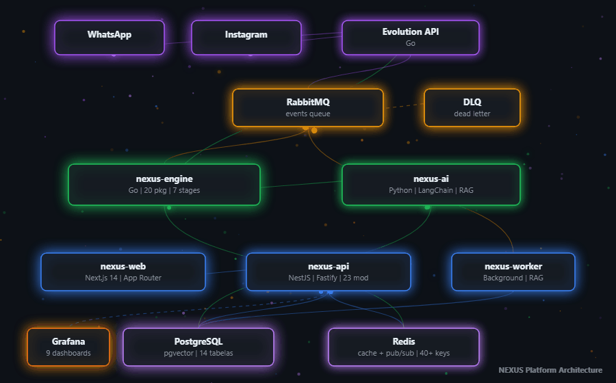
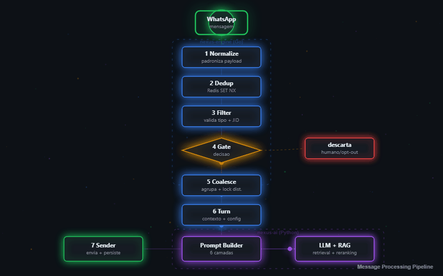
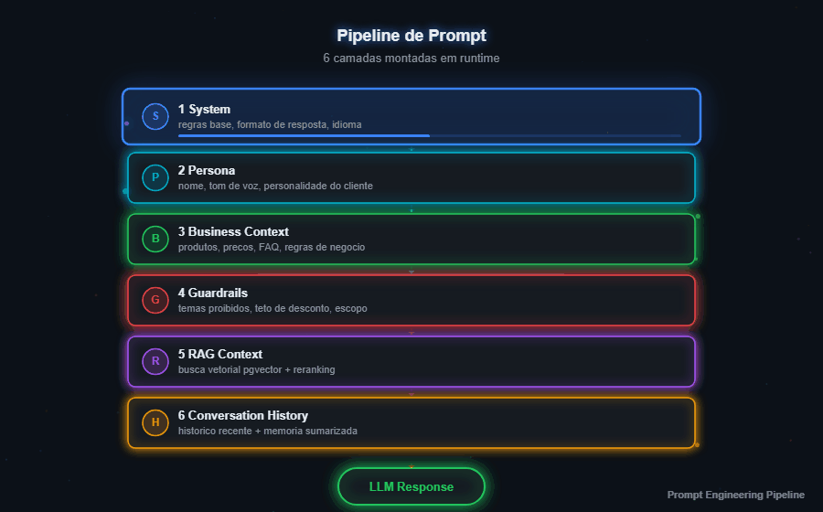
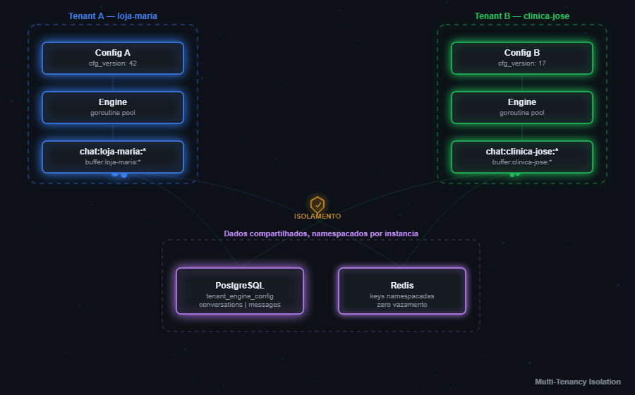
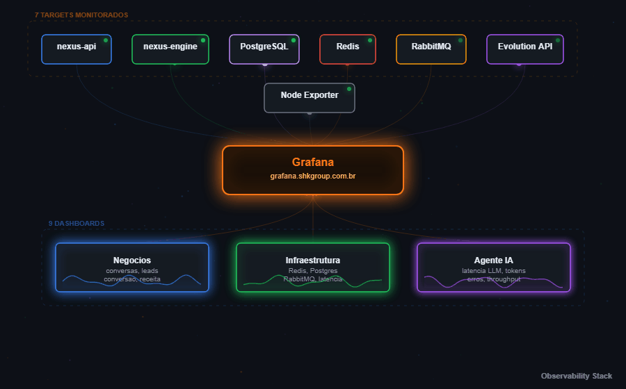
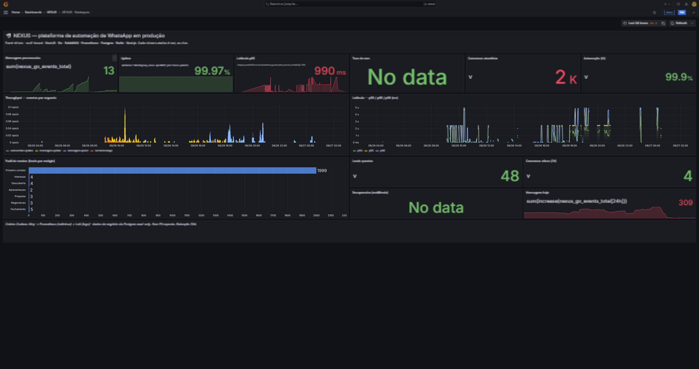
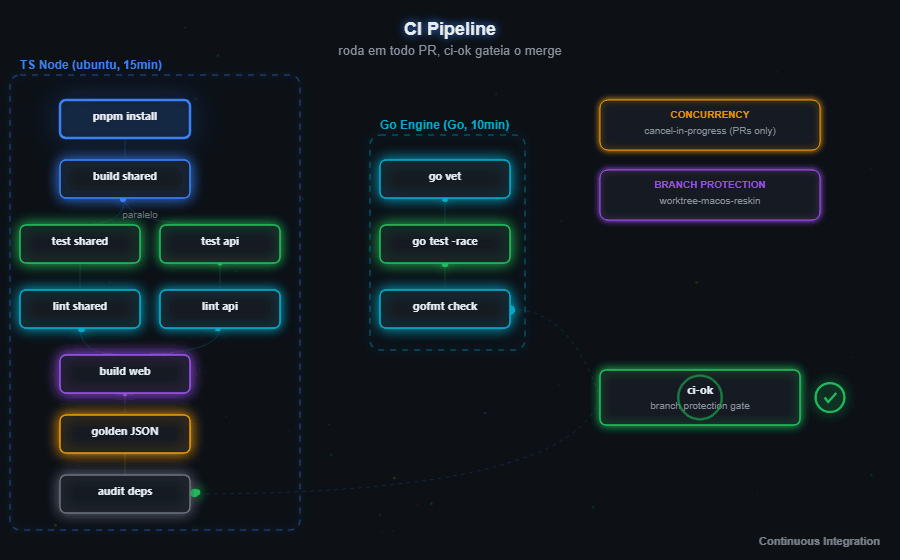

<p align="center">

</p>

<h1 align="center">NEXUS</h1>

<p align="center">
  
  
  
  
  
  
  
  
  
  
</p>

<p align="center">
  <strong>Event-driven microservices platform</strong> para atendimento e vendas por WhatsApp com agente de IA integrado.
  <br />
  Go + Python + TypeScript. 6 servicos. Multi-tenant. Observabilidade em producao.
</p>

---

Plataforma SaaS multi-tenant que conecta um agente de IA ao WhatsApp do cliente. O agente responde, qualifica leads e permite takeover humano. O ciclo atual prioriza consolidar o core de mensagens, metadata, operação e escala; RAG, harness e memória persistente permanecem como evolução futura, fora do caminho crítico.

## Arquitetura: event-driven microservices

O NEXUS segue uma **arquitetura orientada a eventos com microservicos**, onde 6 servicos independentes se comunicam exclusivamente por mensageria assincrona (RabbitMQ). Nenhum servico chama outro diretamente via HTTP. Cada servico tem deploy, scaling e failure domain proprios.

Essa decisao arquitetural veio de uma restricao real do dominio: o processamento de IA leva 3-8 segundos por turno. Se o pipeline fosse sincrono, uma chamada lenta ao LLM seguraria conexoes HTTP, threads e memoria do servico principal. Com event-driven, o API aceita o request e retorna, o engine consome no ritmo dele, e se o servico de IA cair, as mensagens ficam na fila ate ele voltar - resiliencia por design, nao por workaround.

<p align="center">
  
</p>

### Patterns arquiteturais

| Pattern | Onde | Por que |
|---------|------|---------|
| **Event-Driven Architecture** | RabbitMQ como backbone entre todos os servicos | Producer nao sabe quem consome, consumer nao sabe quem publicou. Servicos escalam e falham independentemente |
| **CQRS** | nexus-api (command/write) vs nexus-engine (query/read) | API escreve config e conversas no Postgres. Engine le config e historico do Redis. Cada lado otimizado pro seu workload |
| **Write-Through Cache** | tenant-config no API | Config salva no Postgres e no Redis na mesma operacao. Engine le sempre do Redis (< 1ms). Reconcile periodico garante consistencia |
| **Idempotent Consumer** | dedup no engine via Redis SET NX | Mensagens duplicadas do WhatsApp descartadas por message ID. Cada evento processado exatamente uma vez |
| **Circuit Breaker** | nexus-ai na chamada ao LLM provider | Se o provider fica instavel, o circuit abre e fallback entra. Protege o pipeline de cascading failure |
| **Dead Letter Queue** | RabbitMQ DLQ | Mensagens que falham apos N retries vao pra DLQ pra analise posterior, nunca descartadas silenciosamente |
| **Pub/Sub** | Socket.IO com Redis adapter | Eventos de conversa, presence e dashboard propagados em tempo real sem polling |

### Servicos

| Servico | Stack | Responsabilidade |
|---------|-------|------------------|
| **nexus-engine** | Go, 20 packages | Orquestrador de mensagens: consome fila AMQP, executa pipeline de 7 estagios (normalize, dedup, filter, gate, coalesce, turn, send), roteia pro servico de IA via gRPC |
| **nexus-ai** | Python | Servico de inteligencia: pipeline de prompt, providers configuraveis, streaming, limites de entrada e circuit breaker. RAG, memoria e harness estao congelados |
| **nexus-api** | NestJS, Fastify, Drizzle ORM | Backend user-facing: auth JWT + magic link, CRUD de conversas, billing Mercado Pago (PIX + cartao), config do agente com write-through cache, fachada Evolution, realtime Socket.IO. 23 modulos, 14 tabelas |
| **nexus-worker** | NestJS (background) | Processamento assincrono existente e encaminhamento controlado de eventos; jobs de RAG, memoria e novas automacoes nao fazem parte do core liberado |
| **nexus-web** | Next.js 14, App Router | Painel web com design system macOS: Agent Studio, chat WhatsApp Web parity (emoji, audio, foto, reply, read receipts), dashboard realtime, kanban, checkout |
| **nexus-shared** | TypeScript | Contratos e tipos compartilhados. Keys Redis espelhadas byte a byte entre TS e Go |

---

## Pipeline de conversa

Quando um lead manda uma mensagem no WhatsApp, ela percorre um pipeline de 7 estagios dentro do engine Go antes do agente responder. Cada estagio tem responsabilidade unica e pode ser observado individualmente no Grafana.

<p align="center">
  
</p>

O **Gate** e o ponto de decisao critico do pipeline. Verifica se a conversa esta sob atendimento humano (`humanControlUntil`), se o lead fez opt-out de IA, ou se a mensagem e do proprio agente (self-chat prevention). Se qualquer condicao for verdadeira, o pipeline para.

O **Coalescer** resolve um problema concreto do WhatsApp: usuarios mandam 3-5 mensagens curtas em sequencia ("oi" / "tudo bem?" / "quanto custa?"). Sem coalescing, o agente responderia cada uma separadamente. O coalescer agrupa tudo numa janela de tempo com lock distribuido Redis, garantindo uma unica resposta coerente.

### Pipeline de prompt: 6 camadas montadas em runtime

O prompt do agente nao e um template fixo. E montado em runtime pelo nexus-ai com 6 camadas que se empilham, cada uma configuravel pelo cliente via Agent Studio:

<p align="center">
  
</p>

A camada de **Guardrails** (em vermelho) e a unica que define restricoes: temas proibidos, teto de desconto, escopo do agente. Fica separada das regras positivas pra facilitar auditoria.

A camada de contexto enriquecido para RAG esta documentada como extensao futura, mas permanece desligada neste ciclo. O caminho liberado usa apenas as fontes ja consolidadas e observaveis do tenant.

---

## Multi-tenancy: isolamento por instancia

Cada cliente e uma instancia. Toda operacao - Redis, Postgres, RabbitMQ - e namespacada por essa instancia. Nao existe possibilidade de um tenant acessar dados de outro, nem por bug de query, porque as keys sao estruturalmente diferentes.

<p align="center">
  
</p>

Config do agente versionada com `cfg_version`. Write-through garante que o engine sempre le a versao mais recente do Redis. Reconcile periodico detecta divergencias entre Postgres e cache.

---

## Observabilidade em producao

Stack Grafana rodando em [grafana.shkgroup.com.br](https://grafana.shkgroup.com.br), com 7 targets monitorados e 9 dashboards cobrindo metricas de negocio, saude da infra e performance do agente de IA.

<p align="center">
  
</p>

<p align="center">
  <a href="https://grafana.shkgroup.com.br/public-dashboards/bac21dd05cb044cd8469e097784f8dc2">
    
  </a>
  <br />
  <em>Dashboard real: 2K conversas, 48 leads qualificados, 99.97% uptime, p95 990ms. Clique na imagem para ver ao vivo.</em>
</p>

<p align="center">
  <a href="https://grafana.shkgroup.com.br/public-dashboards/bac21dd05cb044cd8469e097784f8dc2">
    
  </a>
</p>

1.800+ conversas trackeadas. Alertas configurados pra anomalias de latencia, crescimento de fila e erros de LLM.

---

## Autenticacao e roles

Login por magic link, sem senha. O usuario informa o email, recebe um link unico com validade de 15 minutos, e ao clicar entra direto no painel com JWT. O link e single-use e nao revela se o email existe na base (anti-enumeracao).

### Fluxo de autenticacao

1. **Request magic link** - usuario envia email, sistema gera token unico no Redis com TTL de 15 min. Cooldown de 90 segundos impede spam de emails
2. **Callback** - usuario clica no link, token validado e deletado (single-use). JWT access + refresh emitidos como cookies HTTP-only
3. **Sessao** - access token de curta duracao, refresh token de longa duracao com rotacao automatica. Ao renovar, o refresh anterior e invalidado
4. **Logout** - token adicionado a uma blacklist no Redis com TTL igual ao tempo restante. Cookies limpos no cliente

### Hierarquia de roles

Tres papeis com permissoes crescentes. O guard de roles atua no backend, nao so na UI.

| Role | Escopo | Permissoes |
|------|--------|------------|
| **operator** | Tenant unico | Acesso ao chat, kanban e dashboard. Nao gerencia billing nem config do agente |
| **admin** | Tenant unico | Tudo do operator + config do agente (Agent Studio), billing, checkout, gestao de operadores |
| **superadmin** | Cross-tenant | Bypassa todos os guards de role e de plano. Acesso a rotas administrativas da plataforma, gestao de todos os tenants |

O guard de JWT roda globalmente em todas as rotas HTTP. O guard de roles verifica se o papel do usuario atende ao minimo exigido pela rota (decorator `@Roles`). O superadmin passa automaticamente por qualquer verificacao de role ou plano.

---

## Billing e plan gating

Tres planos com gating real no backend via `PlanGuard` - nao so na UI. Tenant do plano Start que tenta usar feature do Pro recebe 403.

| Plano | Preco | Capacidades |
|-------|-------|-------------|
| **Start** | R$99,90/mes | Agente basico, chat WhatsApp, funil, dashboard |
| **Pro** | R$197,90/mes | Followup automatico, midia rica, lembretes, link de pagamento |
| **Obsidian** | R$547,90/mes | RAG completo, memoria por lead, harness (tools externas), campanhas Meta |

### O que muda na pratica entre os planos

A diferenca entre planos nao e so marketing. Cada upgrade desbloqueia capacidade real no engine e no backend, com enforcement via `PlanGuard` (decorator `@RequiresPlan` no NestJS) e write-through pro engine Go via Redis.

**Capacidade de infraestrutura:**

| | Start | Pro | Obsidian |
|---|---|---|---|
| Instancias WhatsApp | 1 | 2 | Ilimitadas |
| Retencao de historico (Redis) | 7 dias | 30 dias | Sem expiracao |

O historico nao e so um numero no dashboard. O TTL e aplicado diretamente no Redis pelo engine Go: mensagens do Start expiram apos 7 dias de forma automatica. Pro mantem 30 dias. Obsidian nunca expira. Isso afeta diretamente a qualidade do contexto que o agente recebe na hora de responder, porque o prompt e montado a partir do historico disponivel.

**Modules e capacidades do agente:**

| Capacidade | Start | Pro | Obsidian |
|------------|-------|-----|----------|
| Chat WhatsApp + funil + dashboard | Sim | Sim | Sim |
| Config do agente (Agent Studio) | Sim | Sim | Sim |
| Followup automatico | Bloqueado | Sim | Sim |
| Midia rica (audio, imagem, documento) | Bloqueado | Sim | Sim |
| Lembretes agendados | Bloqueado | Sim | Sim |
| Link de pagamento inline | Bloqueado | Sim | Sim |
| RAG (base de conhecimento) | Bloqueado | Sim | Sim |
| AI Memory (memoria persistente por lead) | Bloqueado | Sim | Sim |
| Harness (tools externas, webhooks, SDKs) | Bloqueado | Bloqueado | Sim |
| Campanhas Meta (trafego pago) | Bloqueado | Bloqueado | Sim |

Cada flag e uma coluna booleana na tabela `plans` do Postgres. O guard verifica no backend antes de executar qualquer acao. Nao e um check de UI que pode ser bypassado: se o tenant do plano Start tenta ativar followup via API, recebe 403 com `code: PLAN_REQUIRED`. Superadmins passam por qualquer restricao de plano automaticamente.

**Propagacao pro engine:**

Quando uma assinatura e ativada ou muda de plano, o billing service faz write-through no Redis atualizando o `tenant:cfg:{inst}` com o novo `plan` e `historyDays`. O engine Go le essa config a cada turno, entao a mudanca de plano toma efeito imediato na proxima mensagem, sem restart e sem deploy.

### Ciclo de vida da assinatura

O checkout e integrado com Mercado Pago e suporta PIX (pagamento unico) e cartao (recorrencia). Cada metodo tem seu fluxo de confirmacao, mas o resultado e o mesmo: o plano e ativado no backend e propagado pro engine via write-through no Redis.

**Estados da assinatura:**

| Estado | Significado | Acesso |
|--------|-------------|--------|
| **trial** | Conta nova, explorando | Liberado |
| **pending** | Checkout iniciado, pagamento nao confirmado | Liberado |
| **active** | Pagamento aprovado, assinatura valida | Liberado |
| **past_due** | PIX expirou ou recorrencia pausada | Bloqueado |
| **cancelled** | Cancelado pelo usuario ou pagamento rejeitado | Bloqueado |

### Checkout e confirmacao

1. Admin inicia checkout escolhendo plano e metodo (PIX ou cartao)
2. Sistema valida: nao permite checkout duplicado, mesmo plano ja ativo, ou downgrade (exceto se cancelado)
3. Pagamento criado no Mercado Pago, conta marcada como `pending`
4. Webhook do Mercado Pago confirma o pagamento com verificacao de assinatura HMAC e protecao contra replay
5. Processamento idempotente: mesmo webhook recebido duas vezes nao gera efeito duplicado
6. Plano atualizado no Postgres, cache do tenant invalidado, config propagada pro engine Go via Redis

### Cancelamento

O cancelamento e idempotente e o banco de dados e a fonte de verdade. Se a assinatura era por cartao, a recorrencia e cancelada no Mercado Pago (best-effort). O status muda pra `cancelled` e o `PlanGuard` bloqueia acesso a features restritas. O usuario pode reativar fazendo novo checkout a qualquer momento.

Um scheduler periodico detecta assinaturas ativas com data de expiracao vencida e marca como `past_due` automaticamente.

---

## Seguranca e LGPD

- Prompt injection defense em multiplas camadas (guardrails no prompt + validacao de output)
- Dados criptografados em repouso
- Cascade delete compliant com LGPD (direito ao esquecimento)
- Export de dados do titular sob demanda
- Opt-out de processamento por IA por lead

---

## Decisoes de engenharia e performance

O que diferencia essa stack de um CRUD convencional. Cada decisao abaixo existe porque um problema real apareceu em producao ou em teste de carga.

### gRPC como plano de controle

O engine Go expoe um servico gRPC (`EngineControl`) com RPCs como `NotifyGateChanged`, `InvalidateConfig` e `RunPlayground`. Esse canal e periferico ao caminho critico: se o gRPC cair, o engine continua processando mensagens normalmente via AMQP. A separacao entre plano de dados (RabbitMQ) e plano de controle (gRPC) evita que uma invalidacao de config bloqueie o fluxo de mensagens.

### Atomicidade distribuida com Lua scripts no Redis

Operacoes que precisam de mais de um comando Redis sem race condition rodam como Lua scripts atomicos. Tres casos reais:

- **Coalescer drain** - verifica lock, le o buffer, renomeia pra inflight (recovery em caso de crash) e libera o lock em uma unica execucao atomica
- **Token bucket** - rate limiting distribuido que calcula refill em tempo real por milissegundo, decrementa o token e seta TTL numa unica operacao
- **Archive trim** - le a fatia que vai ser removida e faz LTRIM no mesmo script, garantindo que o retorno e exatamente o que foi cortado

### Circuit breaker e retry compostos

Cada integracao externa tem sua propria policy de resiliencia via `cockatiel`. A Evolution API usa circuit breaker com sampling (60% de erro em 30s trippa o circuito) composto com retry exponencial (500ms a 5s). Erros 5xx e 429 retriam; 4xx falham direto sem gastar tentativas. N8N e Google Sheets tem policies separadas com limiares ajustados pra cada perfil de falha.

### Idempotencia em tres camadas

Mensagens duplicadas sao um fato da vida em sistemas distribuidos. O NEXUS trata isso em tres pontos independentes:

1. **Request-level** - interceptor HTTP com `X-Request-Id`, cache no Redis por 5 minutos, namespace isolado por tenant e usuario
2. **Event dedup na API** - `SET NX EX 48h` seletivo (so `messages.upsert` e `send.message`), com release do lock em caso de erro pra preservar replay
3. **Engine dedup** - prefix separado (`engine:dedup`) com mesma logica, evitando que o Go reprocesse o que a API ja filtrou

### Write-behind cache com projecao duravel

Redis e a fonte de verdade operacional das conversas. Um listener de keyspace detecta mutacoes e projeta os dados pra Postgres via upsert (`ON CONFLICT DO UPDATE`). O dashboard consulta Postgres indexado ao inves de fazer fan-out em milhares de chaves Redis individuais. O archive usa um protocolo anti-perda em duas etapas: primeiro faz tail dos dados quentes pro Postgres, depois executa LTRIM atomico via Lua.

### Token bucket distribuido (quota de LLM)

Antes de cada chamada ao LLM, o engine consulta um token bucket implementado em Lua no Redis. Capacity por minuto, refill suave por milissegundo, compartilhado entre todas as replicas. Funciona como circuit breaker de custo: se o tenant estoura a cota, o turno e rejeitado sem gastar tokens da API.

### Concorrencia no Go engine

Cada turno roda numa goroutine separada com `WaitGroup` tracking. O coalescer usa `SetNX` no Redis como lock distribuido (primeira goroutine ganha, demais desistem). Graceful shutdown propaga cancelamento via `context.Context` e espera as goroutines em voo finalizarem com timeout configuravel. Nenhum turno e perdido no shutdown.

### Shadow mode (validacao A/B do engine)

O engine Go roda em paralelo ao N8N sem enviar nada pro usuario. A resposta gerada e registrada numa tabela `shadow_comparisons` no Postgres, e o sistema aguarda ate 60 segundos pelo eco do N8N pra comparar. State snapshot e capturado na ingestao (antes do debounce) pra evitar drift falso. Isso permitiu validar o pipeline inteiro em producao sem risco.

### Contract testing com golden JSON

Os normalizers TypeScript e Go produzem o mesmo output `NexusEventV1` a partir dos mesmos fixtures. O CI roda golden JSON sync pra garantir que os fixtures sao byte-a-byte identicos entre as duas linguagens. Se alguem muda o contrato no TS sem atualizar o Go (ou vice-versa), o CI quebra.

### Health checks com semantica correta

Tres endpoints com propositos distintos: **liveness** (processo vivo, sempre 200), **readiness** (Postgres + Redis respondem, controla se o load balancer envia trafego) e **startup** (readiness + Evolution API, valida todas as deps antes de aceitar a primeira request). Cada um serve um momento diferente do ciclo de vida do container.

### Observabilidade com cardinalidade controlada

Prometheus com labels fixos (method, path, status) e contadores nomeados por dominio (`nexus_go_events_total`, `nexus_n8n_forwards_total`, `nexus_messages_processed_total`). Histogramas de latencia pra HTTP, Redis e pipeline Go. Cardinalidade travada por design pra nao explodir o TSDB com labels dinamicos. O endpoint `/metrics` e protegido por bearer token dedicado.

### Comparacao timing-safe em toda boundary de seguranca

HMAC de media, webhook signatures do Mercado Pago e API keys da Evolution usam `timingSafeEqual` do Node.js. Nenhuma comparacao de segredo usa `===`.

---

## Quick start

```bash
pnpm install --frozen-lockfile
pnpm -C packages/shared build       # sem o dist/, testes do api falham
pnpm dev                            # sobe api + web
```

Infra (Postgres, Redis, RabbitMQ, Evolution) sobe via `infra/docker-compose.evo-evogo.yml`.

## CI

Pipeline roda em todo PR. A branch `worktree-macos-reskin` exige o check `ci-ok` pra merge.

<p align="center">
  
</p>

Dois jobs paralelos: **Node** (install, build shared, testes, lint, build web, golden JSON sync, audit) e **Engine** (go vet, go test -race, gofmt). Os dois convergem no **ci-ok**, que e o unico check exigido pelo branch protection. Se qualquer step falha, o merge e bloqueado.

Cada workspace e invocado com `pnpm -C <dir> <script>`, nunca com `pnpm -r` ou `--filter` (filter retorna 0 se o script nao existe, mascarando falhas). O golden JSON sync garante que os fixtures TypeScript e Go estao byte-a-byte identicos. Concurrency control cancela pipelines anteriores em PRs, mas nunca na branch principal.

---

## Documentacao

Tudo em [`docs/`](docs/README.md):

- **[Roadmap Mestre](docs/ROADMAP-MASTER.md)** - direcao atual, fases e criterios de entrega
- **[Estado da Consolidacao](docs/CONSOLIDATION-IMPLEMENTATION-STATUS.md)** - baseline de producao e gates abertos
- **[Plano de Consolidacao](docs/PRODUCTION-CONSOLIDATION.md)** - auditoria operacional e ordem segura
- **[Gates de Entrega](docs/DELIVERY-GATES.md)** - controles obrigatorios de PR a producao
- **[Spec v2](docs/nexus-evolution-spec-v2.md)** - arquitetura completa, 153 componentes mapeados, gaps e planos
- **[Roadmap](docs/nexus-dev-roadmap.md)** - 174 checkboxes em 14 fases com gates de validacao
- `docs/specs/` - 14 specs tecnicas de features
- `docs/plans/` - 10 planos de implementacao
- `docs/runbooks/` - 5 runbooks operacionais
- `docs/adr/` - 4 decisoes de arquitetura
